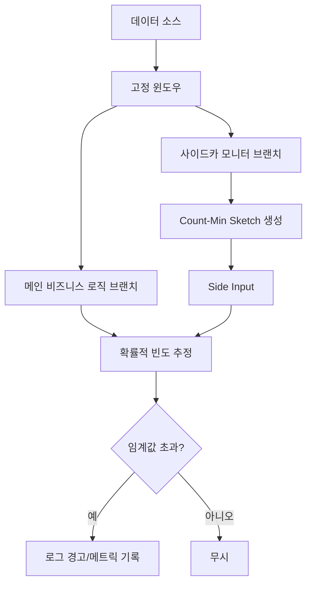

# Dataflow 확률적 Hot Key 로거

이 프로젝트는 Google Cloud Dataflow(Apache Beam)를 사용하여 스트리밍 데이터에서 **Hot Key**(비정상적으로 높은 빈도를 가진 키)를 효율적으로 감지하고 로깅하는 방법을 보여줍니다.

## 🚀 주요 특징

### 1. 확률적 스케칭 (Count-Min Sketch)
대량의 트래픽 환경에서 수백만 개의 고유 키에 대한 빈도를 집계하는 것은 메모리 부족(OOM) 오류를 초래할 수 있습니다. 이 프로젝트는 **Count-Min Sketch** 알고리즘을 활용하여 다음을 제공합니다:
- **고정된 메모리 사용량**: 데이터의 양이나 고유 키의 수에 상관없이 일정한 메모리를 점유합니다.
- **확률적 추정**: 절대적인 정확도 대신 극단적인 효율성을 취하여 거의 실시간에 가까운 빈도 추정을 가능하게 합니다.
- **10% 샘플링 및 외삽(Extrapolation)**: 초고부하 트래픽 시나리오에서 모든 요소에 대해 스케치를 업데이트하는 것은 비용이 많이 들 수 있습니다. 이제 스케치를 위해 요소의 10%만 샘플링하고 결과를 10배로 보정(x10)하여 Hot Key를 감지함으로써 스케치 업데이트 오버헤드를 90% 줄였습니다.
- **Combiner Lifting (최적화)**: `globally()` 집계를 활용하여 Map-side 결합을 가능하게 합니다. 이를 통해 각 워커가 로컬 부분 집계를 수행하도록 하여 네트워크 셔플을 획기적으로 줄이고 데이터 전송 단계에서의 Hot Key 병목 현상을 방지합니다.

### 2. 사이드카 패턴
감지 로직은 메인 비즈니스 로직 파이프라인과 **별도의 브랜치**에서 실행됩니다.
- **안정성**: 감지 로직의 부하나 지연이 실제 비즈니스 데이터 처리에 영향을 주지 않습니다.
- **유연성**: 메인 로직을 변경하지 않고도 감지 알고리즘이나 임계값을 독립적으로 수정할 수 있습니다.

### 3. 최적화된 로깅 및 확장성
- **로그 샘플링**: 메인 비즈니스 로직 브랜치는 가시성을 유지하면서 로그 폭증을 방지하기 위해 **1,000개 레코드**마다 한 번씩만 처리 상태를 샘플링하여 로깅합니다.
- **Beam 메트릭 통합**: 실시간 모니터링을 위한 기본 제공 메트릭:
    - `detected_hot_keys` (Counter): 식별된 Hot Key의 총 개수를 추적합니다.
    - `estimated_counts_dist` (Distribution): 윈도우 전반에 걸친 추정 빈도의 분포를 모니터링합니다.
- **Dataflow Streaming Engine**: 상태 관리를 오프로드하고 Google Cloud에서의 오토스케일링 성능을 향상시키기 위해 명시적으로 활성화되었습니다.

## 🏗 아키텍처 개요



## 🛠 기술 스택
- **언어**: Java 25
- **프레임워크**: Apache Beam 2.70.0
- **데이터 구조**: Count-Min Sketch (`beam-sdks-java-extensions-sketching`)
- **러너**: DirectRunner (로컬 테스트) / DataflowRunner (운영)

## 🏃 실행 방법

### 사전 요구 사항
- JDK 25 이상
- Apache Maven 3.9 이상
- Google Cloud SDK (Dataflow 실행 시 필요)

### 로컬 실행 (DirectRunner)
데이터 분포가 왜곡된 가상 데이터를 생성하여 Hot Key 감지를 테스트합니다.

```bash
mvn compile exec:java \
  -Dexec.mainClass=com.example.dataflow.HotKeyLoggerPipeline \
  -Dexec.args="--runner=DirectRunner \
               --windowDurationSeconds=10 \
               --hotKeyThreshold=500"
```

### 주요 파라미터
- `--windowDurationSeconds`: 빈도를 집계할 윈도우 크기(초 단위).
- `--hotKeyThreshold`: Hot Key로 판단할 최소 카운트.
- `--epsilon`: 스케칭 알고리즘의 상대적 오차 (기본값: 0.01).
- `--confidence`: 스케칭 알고리즘의 신뢰 수준 (기본값: 0.99).

## 📝 코드 구조
- `HotKeyLoggerPipeline.java`: 파이프라인 구성 및 실행 엔트리 포인트.
- `SketchBasedHotKeyDetector.java`: 확률적 Count-Min Sketch 기반 감지를 위한 사이드카 트랜스폼.
- `SyntheticDataGenerator.java`: 키 분포가 왜곡된(예: Zipfian 형태) 가상 데이터 생성기.

## 🔍 모니터링
파이프라인 실행 시 잠재적인 Hot Key를 나타내는 경고 로그를 확인하세요:
`[Sketch-Sampling-Sidecar] Detected Potential HOT KEY: [hot-key-A], Extrapolated Count: [1465] (Sampled: 146)`

또한 메인 비즈니스 로직 샘플링을 모니터링하십시오:
`[Main-Business-Sample] Processed 1000 keys. Current Sample - Key: hot-key-A, Count: 482`

이 프로젝트는 모니터링 대시보드에서 쉽게 시각화할 수 있도록 Apache Beam Metrics와 통합되도록 설계되었습니다.
