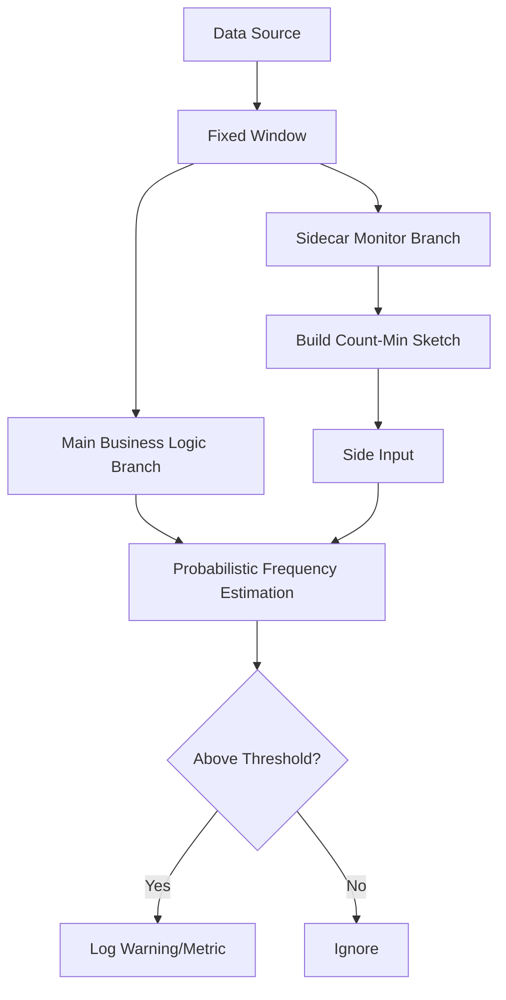

# Dataflow Probabilistic Hot Key Logger

이 프로젝트는 Google Cloud Dataflow(Apache Beam)를 사용하여 스트리밍 데이터에서 **Hot Key(빈도가 비정상적으로 높은 키)**를 실시간으로 감지하고 로깅하는 효율적인 방안을 제시합니다.

## 🚀 주요 특징

### 1. 확률적 스케칭 (Count-Min Sketch)
대규모 트래픽 환경에서 수백만 개의 고유 키 빈도를 모두 합산하는 것은 메모리 부족(OOM)의 주요 원인이 됩니다. 본 프로젝트는 **Count-Min Sketch** 알고리즘을 사용하여:
- **고정된 메모리 사용량**: 데이터의 양이나 키의 개수와 무관하게 일정한 메모리만 점유합니다.
- **확률적 추정**: 약간의 오차를 허용하는 대신 초고속 빈도 추정이 가능합니다.

### 2. 사이드카(Sidecar) 패턴
감지 로직을 메인 데이터 처리 파이프라인과 분리된 **별도의 브랜치**에서 실행합니다.
- **안정성**: 감지 로직의 부하나 지연이 실제 비즈니스 데이터 처리에 영향을 주지 않습니다.
- **유연성**: 메인 로직 수정 없이 감지 알고리즘이나 임계값을 독립적으로 변경할 수 있습니다.

## 🏗 아키텍처 개요



## 🛠 기술 스택
- **Language**: Java 25
- **Framework**: Apache Beam 2.70.0
- **Data Structure**: Count-Min Sketch (`beam-sdks-java-extensions-sketching`)
- **Runner**: DirectRunner (로컬 테스트용) / DataflowRunner (운영용)

## 🏃 실행 방법

### 사전 요구 사항
- JDK 25 이상
- Apache Maven 3.9+
- Google Cloud SDK (Dataflow 실행 시 필요)

### 로컬 실행 (DirectRunner)
테스트용 가상 데이터를 생성하여 Hot Key를 감지합니다.

```bash
mvn compile exec:java \
  -Dexec.mainClass=com.example.dataflow.HotKeyLoggerPipeline \
  -Dexec.args="--runner=DirectRunner \
               --windowDurationSeconds=10 \
               --hotKeyThreshold=500"
```

### 주요 옵션
- `--windowDurationSeconds`: 빈도를 합산할 윈도우 크기 (초 단위)
- `--hotKeyThreshold`: Hot Key로 판단할 최소 빈도수
- `--epsilon`: 스케칭 알고리즘의 오차 범위 (기본값: 0.01)
- `--confidence`: 스케칭 알고리즘의 신뢰도 (기본값: 0.99)

## 📝 코드 구조
- `HotKeyLoggerPipeline.java`: 파이프라인 구성 및 실행 엔트리 포인트
- `SketchBasedHotKeyDetector.java`: Count-Min Sketch 기반의 사이드카 감지 트랜스폼
- `SyntheticDataGenerator.java`: 왜곡된 키 분포를 가진 테스트 데이터 생성기

## 🔍 모니터링
파이프라인 실행 시 로그에 다음과 같은 경고가 발생하면 Hot Key가 감지된 것입니다:
`[Sketch-Sidecar] Detected Potential HOT KEY: [hot-key-A], Estimated Count: [1465]`

이 프로젝트는 Apache Beam Metrics를 포함하도록 설계되어, 실시간 UI 모니터링 도구와 연동이 용이합니다.
