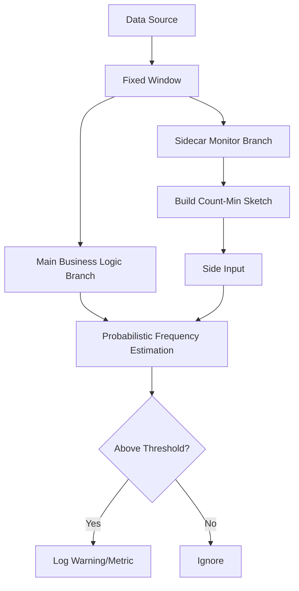

# Dataflow Probabilistic Hot Key Logger

This project demonstrates an efficient approach to detecting and logging **Hot Keys** (keys with abnormally high frequencies) in streaming data using Google Cloud Dataflow (Apache Beam).

## 🚀 Key Features

### 1. Probabilistic Sketching (Count-Min Sketch)
In high-volume traffic environments, aggregating frequencies for millions of unique keys can lead to Out of Memory (OOM) errors. This project utilizes the **Count-Min Sketch** algorithm to provide:
- **Fixed Memory Footprint**: Occupies a constant amount of memory regardless of the volume of data or the number of unique keys.
- **Probabilistic Estimation**: Trading absolute accuracy for extreme efficiency, allowing for near real-time frequency estimation.
- **Combiner Lifting (Optimization)**: Utilizes `globally()` aggregation to enable Map-side combining. This ensures each worker performs local partial aggregation, dramatically reducing network shuffle and avoiding Hot Key bottlenecks at the data transfer level.

### 2. Sidecar Pattern
The detection logic is executed in a **separate branch** from the main business logic pipeline.
- **Stability**: Load or latency in the detection logic does not impact the processing of actual business data.
- **Flexibility**: Detection algorithms or thresholds can be modified independently without altering the main logic.

## 🏗 Architecture Overview



## 🛠 Tech Stack
- **Language**: Java 25
- **Framework**: Apache Beam 2.70.0
- **Data Structure**: Count-Min Sketch (`beam-sdks-java-extensions-sketching`)
- **Runner**: DirectRunner (Local testing) / DataflowRunner (Production)

## 🏃 How to Run

### Prerequisites
- JDK 25 or higher
- Apache Maven 3.9+
- Google Cloud SDK (Required for running on Dataflow)

### Local Execution (DirectRunner)
Generate synthetic data with skewed key distributions to test hot key detection.

```bash
mvn compile exec:java \
  -Dexec.mainClass=com.example.dataflow.HotKeyLoggerPipeline \
  -Dexec.args="--runner=DirectRunner \
               --windowDurationSeconds=10 \
               --hotKeyThreshold=500"
```

### Main Parameters
- `--windowDurationSeconds`: The window size for aggregating frequencies (in seconds).
- `--hotKeyThreshold`: The minimum count to be considered a Hot Key.
- `--epsilon`: Relative error of the sketching algorithm (Default: 0.01).
- `--confidence`: Confidence level of the sketching algorithm (Default: 0.99).

## 📝 Code Structure
- `HotKeyLoggerPipeline.java`: Pipeline configuration and execution entry point.
- `SketchBasedHotKeyDetector.java`: Sidecar transform for probabilistic Count-Min Sketch based detection.
- `SyntheticDataGenerator.java`: Generator of mock data with skewed key distributions (e.g., zipfian-like).

## 🔍 Monitoring
When running the pipeline, look for warning logs indicating potential hot keys:
`[Sketch-Sidecar] Detected Potential HOT KEY: [hot-key-A], Estimated Count: [1465]`

The project is designed to integrate with Apache Beam Metrics for easy visualization in monitoring dashboards.
